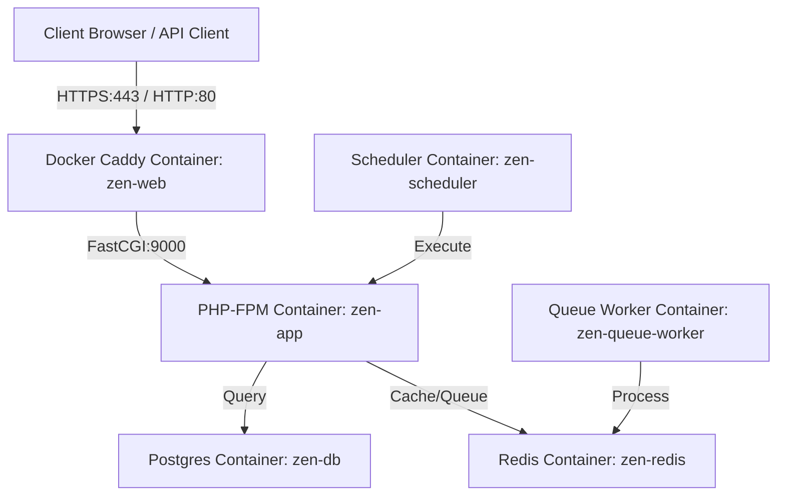

# Production Deployment Guide: Deploying `zen-backend` on DigitalOcean Ubuntu Droplet

This guide details the exact step-by-step process for deploying the `zen-backend` application using **Docker Compose** and **Caddy** for zero-host-configuration automatic Let's Encrypt HTTPS.

This application is built with:
- **PHP 8.3-FPM** with compiled Redis, PDO, and standard extensions.
- **Caddy Web Server** managing SSL certificates via Let's Encrypt and proxying PHP requests.
- **PostgreSQL 16** as the persistent database service.
- **Redis 7** acting as the high-performance cache and queue broker.
- **Laravel Queue Worker** processing asynchronous jobs under a restricted `www-data` user.
- **Laravel Scheduler** executing periodic cron tasks.

---

## Deployment Architecture Overview



In this production environment, we use a **fully containerized single-tier architecture**:
1. **Caddy (`zen-web`)**: Binds directly to the Droplet's ports `80` and `443`. It automatically requests, installs, and renews Let's Encrypt SSL certificates based on the `APP_DOMAIN` environment variable.
2. **PHP-FPM (`zen-app`)**: Caddy forwards PHP requests directly to `zen-app:9000` via FastCGI.

---

## Phase 1: Provisioning and Securing the DigitalOcean Droplet

### 1. Create the Droplet in DigitalOcean
1. Log in to the **DigitalOcean Control Panel**.
2. Click **Create** (top right) -> **Droplets**.
3. **Region**: Choose the data center closest to your users.
4. **Image**: Choose **Ubuntu 24.04 LTS** (or 22.04 LTS).
5. **Size**: Choose **Basic CPU** -> **Regular SSD** or **Premium Intel/AMD** (minimum 1 GB RAM / 1 vCPU is required, 2 GB RAM is recommended for building assets).
6. **Authentication**: Select **SSH Keys** (add your public SSH key).
7. Click **Create Droplet**.

### 2. Log In and Update System Packages
Once the Droplet is active, copy its IP address and establish an SSH connection:
```bash
ssh root@your-droplet-ip
```
After connecting, run:
```bash
sudo apt update && sudo apt upgrade -y
```

### 3. Hardening Server Access (UFW Firewall)
To secure the network interfaces of your Droplet, restrict all open ports except those explicitly required for web traffic and administration:
```bash
# Configure default policies
sudo ufw default deny incoming
sudo ufw default allow outgoing

# Allow operational ports
sudo ufw allow 22/tcp    # SSH
sudo ufw allow 80/tcp    # HTTP
sudo ufw allow 443/tcp   # HTTPS

# Enable the firewall rules
sudo ufw enable
```
*Verify UFW status:*
```bash
sudo ufw status verbose
```

---

## Phase 2: Installing Docker

We will install Docker Engine and Docker Compose from official upstream repositories.

### 1. Install Docker and Docker Compose
```bash
# Install system pre-requisites
sudo apt-get install -y ca-certificates curl gnupg

# Add Docker's official GPG key
sudo install -m 0755 -d /etc/apt/keyrings
sudo curl -fsSL https://download.docker.com/linux/ubuntu/gpg -o /etc/apt/keyrings/docker.asc
sudo chmod a+r /etc/apt/keyrings/docker.asc

# Register official repository
echo \
  "deb [arch=$(dpkg --print-architecture) signed-by=/etc/apt/keyrings/docker.asc] https://download.docker.com/linux/ubuntu \
  $(. /etc/os-release && echo "$VERSION_CODENAME") stable" | \
  sudo tee /etc/apt/sources.list.d/docker.list > /dev/null

sudo apt-get update

# Install Docker packages
sudo apt-get install -y docker-ce docker-ce-cli containerd.io docker-buildx-plugin docker-compose-plugin
```

### 2. Verification
Verify that Docker is running smoothly:
```bash
docker --version
docker compose version
sudo systemctl status docker --no-pager
```

---

## Phase 3: Code Deployment & Configuration

We will organize the code under `/var/www/zen-backend` and configure our environments.

### 1. Create a Non-Root User (Optional but Highly Recommended)
For safety, avoid running commands as root where possible. Create a dedicated deploy user:
```bash
sudo adduser deploy
sudo usermod -aG sudo,docker deploy
```
*Now, switch to the new user:*
```bash
su - deploy
```

### 2. Set Up the Project Directory
```bash
sudo mkdir -p /var/www/zen-backend
sudo chown -R deploy:deploy /var/www/zen-backend
cd /var/www/zen-backend
```

### 3. Deploy the Repository
Clone your project repository directly into the current folder:
```bash
git clone git@github.com:your-organization/zen-backend.git .
```
*(If you are using private repositories, configure an SSH Deploy Key on GitHub/GitLab first).*

### 4. Configure Production Environment variables
Create the production `.env` file from the repository template:
```bash
cp .env.example .env
nano .env
```

Ensure the following production settings are populated:
```env
APP_NAME=ZenBackend
APP_ENV=production
APP_DEBUG=false
APP_URL=https://yourdomain.com

# Caddy Domain Configuration (Used to request Let's Encrypt SSL automatically)
APP_DOMAIN=yourdomain.com

DB_CONNECTION=pgsql
DB_HOST=db
DB_PORT=5432
DB_DATABASE=zen_backend
DB_USERNAME=zen_admin
DB_PASSWORD=your_highly_secure_password

REDIS_HOST=redis
REDIS_PORT=6379

QUEUE_CONNECTION=redis
CACHE_STORE=redis
SESSION_DRIVER=redis

# Let Caddy Docker container bind directly to ports 80/443 on the Droplet host
FORWARD_HTTP_PORT=80
FORWARD_HTTPS_PORT=443

# Internal database & redis expose settings (keep these secure/restricted)
FORWARD_DB_PORT=5433
FORWARD_REDIS_PORT=6379

RUN_MIGRATIONS=true
```

---

## Phase 4: Pointing your Domain Name
Before launching the application, you must point your domain names to your Droplet's public IP address. In your domain registrar or DNS provider (e.g., Cloudflare, Namecheap):

1. Add an **A Record**:
   - **Host/Name**: `@`
   - **Value**: `[Your Droplet's Public IP]`
2. Add a **CNAME Record**:
   - **Host/Name**: `www`
   - **Value**: `yourdomain.com`

*Wait a few minutes for DNS propagation before running the Docker containers so Caddy can successfully complete the HTTP Let's Encrypt validation challenge.*

---

## Phase 5: Building and Launching the Docker Environment

With the host infrastructure and DNS ready, build and start your Docker services. Caddy will automatically request and install the SSL certificate on startup.

### 1. Generate Laravel Security Key
Generate the static encryption key used for hashes, cookies, and tokens:
```bash
# Since we are using Docker, run this inside the container context once
docker compose run --rm app php artisan key:generate
```
Copy the generated key from output and ensure it is updated inside your host `.env` file if it was not auto-saved.

### 2. Launch the Application Suite
Build the customized PHP image and launch all containers in detached mode:
```bash
docker compose up --build -d
```

---

## Phase 6: Post-Deployment Verification

Verify that all systems are operational:

### 1. Verify Container States
Check the health status of all services:
```bash
docker compose ps
```
Your output should resemble:
```text
NAME                IMAGE               COMMAND                  SERVICE             CREATED             STATUS              PORTS
zen-app             zen-backend-app     "/var/www/docker/en…"   app                 3 minutes ago       Up 3 minutes        9000/tcp
zen-db              postgres:16-alpine  "docker-entrypoint.s…"   db                  3 minutes ago       Up 3 minutes        5432/tcp, 0.0.0.0:5433->5432/tcp
zen-queue-worker    zen-backend-app     "/var/www/docker/en…"   queue-worker        3 minutes ago       Up 3 minutes        9000/tcp
zen-redis           redis:7-alpine      "docker-entrypoint.s…"   redis               3 minutes ago       Up 3 minutes        0.0.0.0:6379->6379/tcp
zen-scheduler       zen-backend-app     "/var/www/docker/en…"   scheduler           3 minutes ago       Up 3 minutes        9000/tcp
zen-web             caddy:2-alpine      "caddy run --config…"   web                 3 minutes ago       Up 3 minutes        0.0.0.0:80->80/tcp, 0.0.0.0:443->443/tcp, 80/tcp
```

### 2. Verify Database Connection and Migrations
Check the startup logs of `zen-app` to ensure the database connectivity check succeeded and migrations ran:
```bash
docker compose logs app
```

### 3. Verify SSL Status
Open your browser and navigate to `https://yourdomain.com`. You should see the padlock icon indicating a secure HTTPS connection verified by Let's Encrypt.

---

## Phase 7: Regular Maintenance & Housekeeping

### 1. Update Application Code
To deploy new code modifications:
```bash
cd /var/www/zen-backend
git pull origin main
docker compose up --build -d
```

### 2. Automated Cleanups (Weekly Cron Job)
Prevent build caches and orphaned container volumes from consuming Droplet storage.
Add a weekly cron task on your host server:
```bash
sudo crontab -e
```
Add the following line to execute a clean-up every Sunday at 3:00 AM:
```text
0 3 * * 0 docker system prune -af --volumes > /dev/null 2>&1
```
